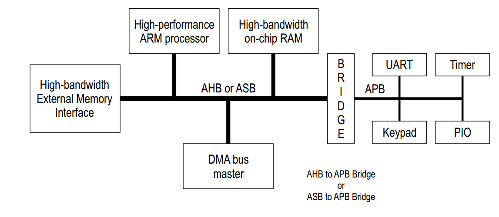
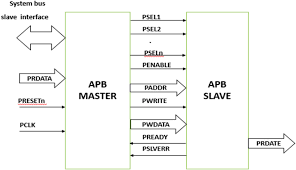
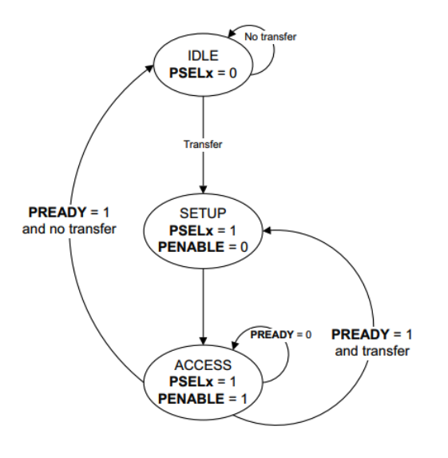

# AMBA and APB Overview

## 1. Introduction to AMBA
AMBA stands for Advanced Microcontroller Bus Architecture. It is developed by ARM to define how IPs and subsystems in an SOC communicated with each other. It is widely used in SoC designs to connect processors, memory, and peripherals in a strucuted and scalable way.

AMBA defines mutiple protocols, each optimized for different performance and complexity requirements

* **AXI (Advanced eXtensible Interface)** - High-performance, high-frequency interfaces (CPUs, DDR)
* **AHB (Advanced High-performance Bus)** – High bandwidth, pipelined bus
* **APB (Advanced Peripheral Bus)** – Low-bandwidth, low-power peripheral bus

In typical SoCs:

* AXI/AHB handle high-speed data transfers
* APB is used for simple peripheral access

## 2. Introduction to APB (Advanced Peripheral Bus)

The **Advanced Peripheral Bus (APB)** is part of the **AMBA (Advanced Microcontroller Bus Architecture)** specification developed by ARM. APB is designed to connect **low-bandwidth, low-power peripherals** to the system bus.

APB is typically used in conjunction with higher-performance buses such as **AXI** or **AHB**, where a bridge converts high-speed transactions into simple APB accesses for peripherals.

APB is optimized for:
- Low power consumption
- Simple interface logic
- Register-based peripheral access

---

## 3. Key Characteristics of APB

| Feature | Description |
|------|------------|
| Bus Type | Non-pipelined |
| Clock Domain | Single clock |
| Burst Support | Not supported |
| Power Consumption | Low |
| Complexity | Low |
| Typical Usage | Peripheral register access |

APB is not intended for high-throughput data transfers. Instead, it is ideal for accessing control and status registers of peripherals.

---

## 4. APB Interface Signals

The APB interface consists of the following key signals:

| Signal | Direction | Description |
|------|---------|-------------|
| `PCLK` | Input | APB clock |
| `PRESETn` | Input | Active-low reset |
| `PADDR` | Master → Slave | Address bus |
| `PSEL` | Master → Slave | Peripheral select |
| `PENABLE` | Master → Slave | Transfer enable |
| `PWRITE` | Master → Slave | Write (1) / Read (0) |
| `PWDATA` | Master → Slave | Write data |
| `PRDATA` | Slave → Master | Read data |
| `PREADY` | Slave → Master | Transfer completion signal |
| `PSLVERR` | Slave → Master | Transfer error indication |

---

## 5. APB Transfer Operation

Each APB transaction occurs in **two phases**:

### 5.1 Setup Phase
- `PSEL` is asserted
- `PENABLE` is deasserted
- Address and control signals are driven and stable

### 5.2 Access Phase
- `PENABLE` is asserted
- Data transfer occurs
- Slave asserts `PREADY` when the transfer is complete

If `PREADY` is low, the access phase is extended until the slave is ready.

---

## 6. APB Peripheral Subsystem

An APB peripheral subsystem consists of:
- An **APB Master** (CPU or AHB/AXI-to-APB bridge)
- An **APB Decoder**
- Multiple **APB Slave peripherals**

In this project, the APB subsystem includes:
- UART Controller
- SPI Controller
- I2C Controller

Each peripheral is mapped into a unique APB address range.

---

## 7. Address Decoding

The APB decoder uses the address bus (`PADDR`) to:
- Select the appropriate peripheral
- Assert the corresponding `PSEL` signal
- Ensure only one slave is active per transaction

Invalid or unmapped address accesses may result in:
- `PSLVERR` assertion
- Default read values

---

## 8. What Is Verified in This Project?

This project focuses on **functional verification** of an APB-based peripheral subsystem using **SystemVerilog and UVM**.

### 8.1 APB Protocol Verification

The following APB protocol aspects are verified:
- Correct setup and access phase sequencing
- Proper timing of `PSEL` and `PENABLE`
- Read and write transaction correctness
- `PREADY` handling for wait states
- `PSLVERR` assertion for error cases
- Reset behavior compliance

---

### 8.2 APB Decoder Verification

Verification ensures that:
- Correct peripheral is selected based on address
- Multiple `PSEL` signals are never asserted simultaneously
- Invalid address accesses are handled correctly

---

### 8.3 Register Access Verification

For each peripheral:
- Read/write register accessibility via APB
- Default reset values
- Read-only and write-only register behavior
- Bit-field functionality and masking
- Side effects of register writes

---

### 8.4 Peripheral Configuration via APB

APB acts as the **control interface** for configuring peripherals:
- UART configuration registers
- SPI mode and control registers
- I2C control and status registers

Functional correctness of these configurations is verified through APB transactions.

---

## 9. Role of UVM in Verification

The **UVM-based testbench** provides:
- A reusable APB agent (driver, sequencer, monitor)
- Transaction-level modeling
- Functional coverage collection
- Scoreboarding and checking
- Scalable and maintainable verification architecture

---

## 10. Summary

The APB bus provides a simple and efficient mechanism for peripheral access. This project verifies:
- APB protocol compliance
- Address decoding correctness
- Register-level functionality
- Peripheral configuration through APB

The use of UVM ensures a robust, reusable, and scalable verification environment.
