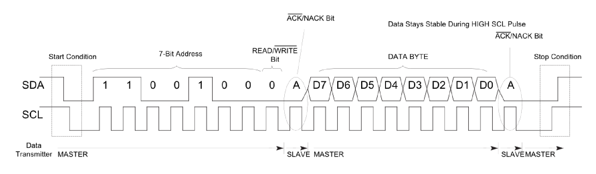

# Peripheral Controllers Overview
## UART, SPI, and I2C

This document provides a **simple explanation** of the UART, SPI, and I2C controllers used in the APB Peripheral Subsystem. These peripherals are controlled through **APB registers** and are commonly found in SoC designs.

---

## 1. UART (Universal Asynchronous Receiver Transmitter)

### 1.1 What is UART?

UART is a **serial communication protocol** used to send and receive data **one bit at a time**.  
It is called *asynchronous* because it does **not use a shared clock** between the sender and receiver.

UART is widely used for:
- Debug messages
- Console communication
- Communication with PCs or microcontrollers

---

### 1.2 How UART Works

UART communication uses:
- **TX** (Transmit)
- **RX** (Receive)

Data is sent in the following format:
- Start bit
- Data bits (usually 8)
- Optional parity bit
- Stop bit(s)

Both sides must be configured with the same **baud rate** (speed).

---

### 1.3 UART in This Project

In this project:
- UART is connected as an **APB slave**
- Configuration is done through APB registers
- Typical registers include:
  - Control register
  - Baud rate register
  - Status register
  - Transmit and Receive data registers

---

## 2. SPI (Serial Peripheral Interface)

### 2.1 What is SPI?

SPI is a **synchronous serial communication protocol** used for **high-speed, short-distance communication** between devices.

SPI uses a **master-slave architecture** and supports full-duplex communication.

---

### 2.2 SPI Signals

SPI typically uses four signals:

| Signal | Description |
|------|-------------|
| MOSI | Master Out, Slave In |
| MISO | Master In, Slave Out |
| SCLK | Serial Clock |
| SS / CS | Slave Select / Chip Select |

---

### 2.3 How SPI Works

- The master generates the clock
- Data is shifted in and out on clock edges
- Communication happens only when `CS` is asserted
- Clock polarity and phase define SPI modes

---

### 2.4 SPI in This Project

In this project:
- SPI controller is an **APB slave**
- APB registers configure:
  - SPI mode (CPOL, CPHA)
  - Clock divider
  - Data format
  - Transfer control

---

## 3. I2C (Inter-Integrated Circuit)

### 3.1 What is I2C?

I2C is a **two-wire serial communication protocol** used for connecting multiple devices on the same bus.

I2C supports:
- Multiple masters
- Multiple slaves
- Address-based device selection

---

### 3.2 I2C Signals

I2C uses only two signals:

| Signal | Description |
|------|-------------|
| SDA | Serial Data |
| SCL | Serial Clock |

Both lines are **open-drain** and require pull-up resistors.

---

### 3.3 How I2C Works

- Communication starts with a **START condition**
- Each slave has a unique address
- Data is transferred in bytes
- Each byte is acknowledged (ACK/NACK)
- Communication ends with a **STOP condition**

---

### 3.4 I2C in This Project

In this project:
- I2C controller is an **APB slave**
- APB registers are used to:
  - Configure clock speed
  - Set slave address
  - Control start/stop conditions
  - Monitor status and errors

---

### 3.5 What Is Verified for I2C?

- APB access to I2C registers
- Start and stop condition generation
- Address matching
- ACK/NACK handling
- Status and error reporting

---

## 4. Role of APB in Peripheral Control

All three peripherals:
- Are **memory-mapped APB slaves**
- Are configured and controlled using APB transactions
- Expose control, status, and data registers

The APB interface acts as the **control and configuration interface**, while the peripheral logic performs the actual communication.

---

## 5. Summary

| Peripheral | Key Feature |
|----------|------------|
| UART | Simple asynchronous serial communication |
| SPI | Fast synchronous master-slave communication |
| I2C | Two-wire, address-based communication |

This project verifies that these peripherals behave correctly when accessed and configured through the APB bus using a UVM-based verification environment.

---

